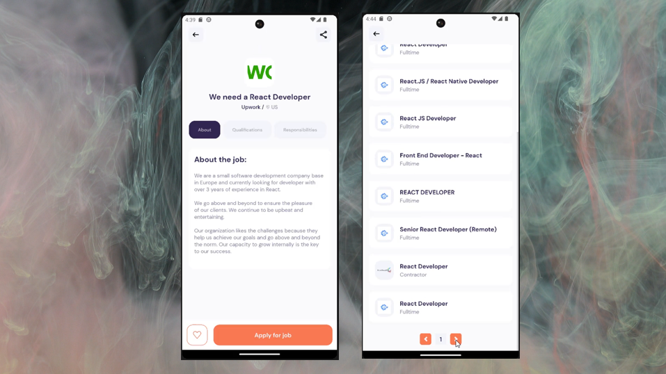

# Hire Me -- Job application
## Welcome! 👋

Thanks for checking out this Application.

## Overview
A full-featured application that allows users to apply for jobs and opportunities with ease, featuring a sleek and user-friendly interface. A powerful tool for job seekers, with a wide range of features to help them find and apply for their dream jobs.

### Links

- App URL: [Github](https://github.com/shaheen7a/Android--Hire-me.git)
- APK Link: API unavailable

## My process

### Built with

- React Native
- Expo Routers
- React Native Fonts
- Custom Hook (useFetch)
- CSS
- JavaScript
- JSX

## Author

- Linkedin - [@aous-shaheen-381636221](https://www.linkedin.com/in/shaheen2001/)
- Facebook - [@aoushaheen7](https://www.facebook.com/shaheen72001/)

By me 🚀🚀🚀
Aous Shaheen
...

